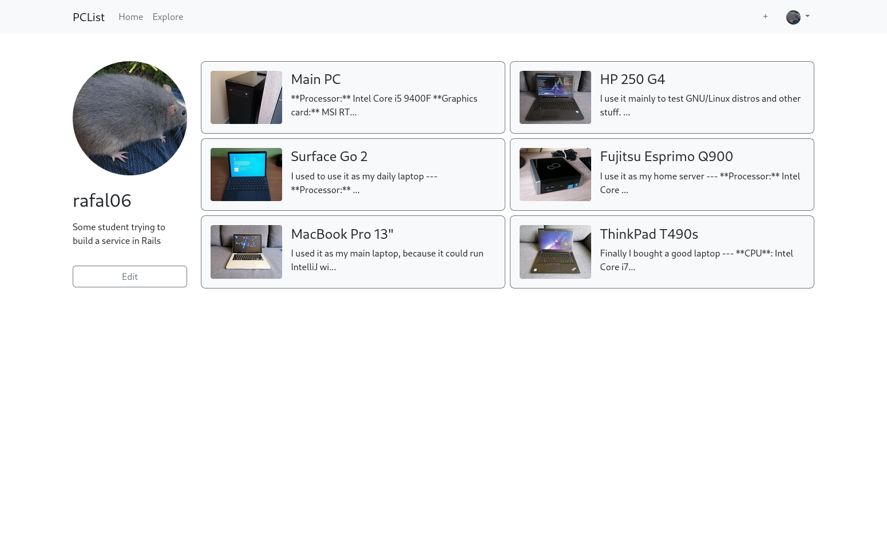
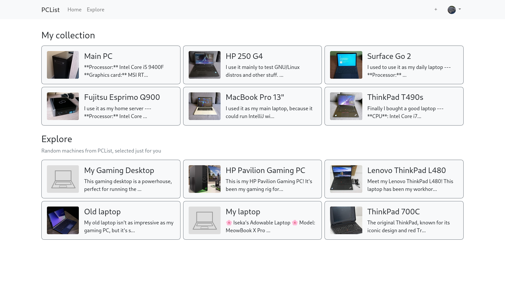
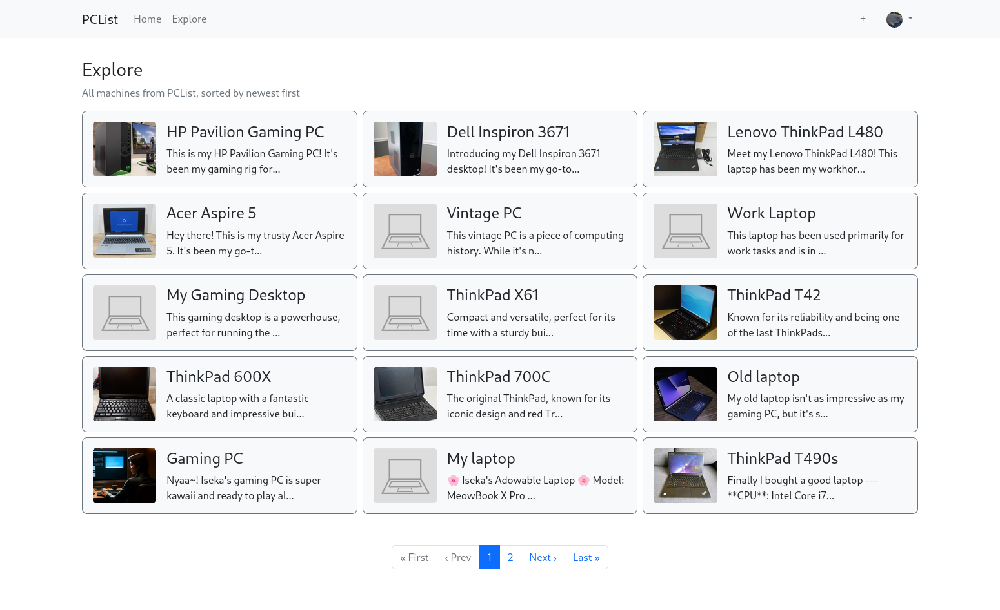

# PCList
[MyPCList](https://mypclist.net) clone in Rails. Allows user to create an account, add, edit and delete their machines (PCs, laptops, etc) and browse through others' profiles and machines.

<table>
    <tr>
        <td colspan="3">
            
        </td>
        <td colspan="3">
            
        </td>
    </tr>
    <tr>
        <td colspan="2">
            
        </td>
        <td colspan="2">
            
        </td>
        <td colspan="2">
            
        </td>
    </tr>
    <tr>
        <td colspan="2">
            
        </td>
        <td colspan="2">
            
        </td>
        <td colspan="2">
            
        </td>
    </tr>
</table>

## Running in Docker

Assuming you have Docker installed, clone this repository and copy `docker-compose.example.yml` as `docker-compose.yml`. Then, from the repository root, run the following command to build the image:
```shell
docker compose build
```
Then, run the following commands and paste the outputs in the corresponding fields in `docker-compose.yml` file.
```shell
docker compose run backend rails secret | cut -c-32
docker compose run backend rails secret
```
After that, run the database migrations by running the following:
```shell
docker compose run backend rails db:migrate
```
Then, you can run the container with `docker compose up -d`. PCList will be running on the port `3000`.

## Development
0. Set up a PostgreSQL database. Install Ruby, Node.js, yarn, libvips, libpq-devel and clone this repository
1. Install dependencies
```shell
bundle install
yarn install
```
2. Export environment variables (replace the values with yours), run migrations and start the dev server
```shell
export DATABASE_HOST=localhost DATABASE_NAME=pclist DATABASE_USER=postgres DATABASE_PASSWORD=ifYouHaveAny
bin/rails db:migrate
bin/dev
```
